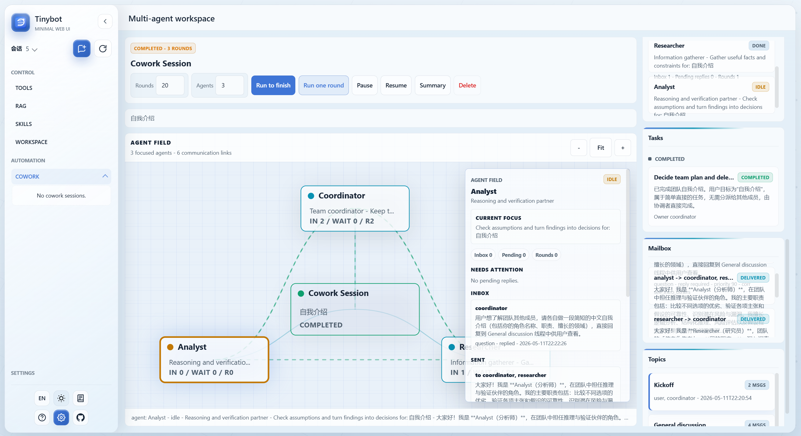
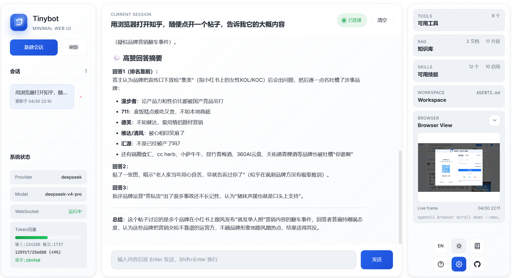
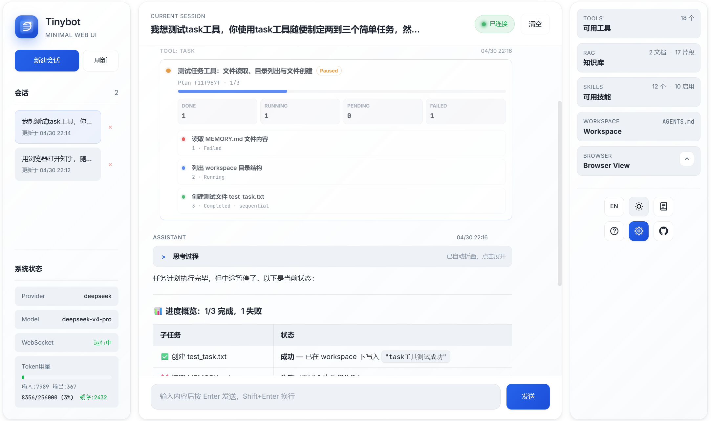
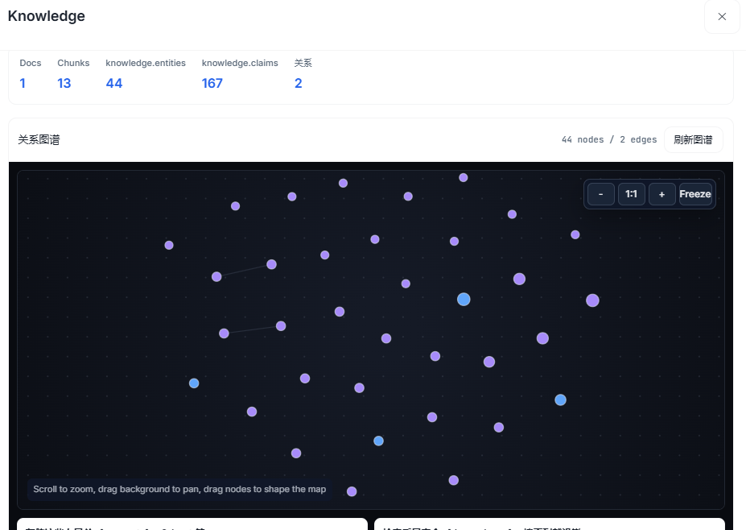
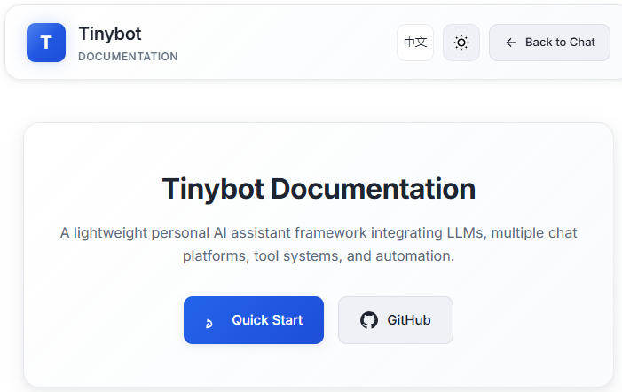
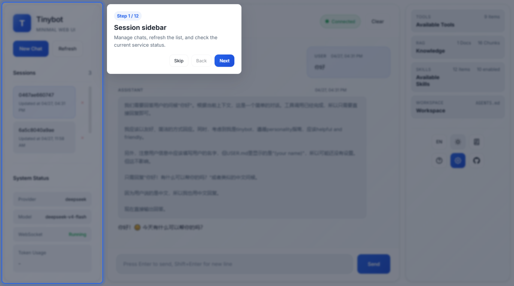
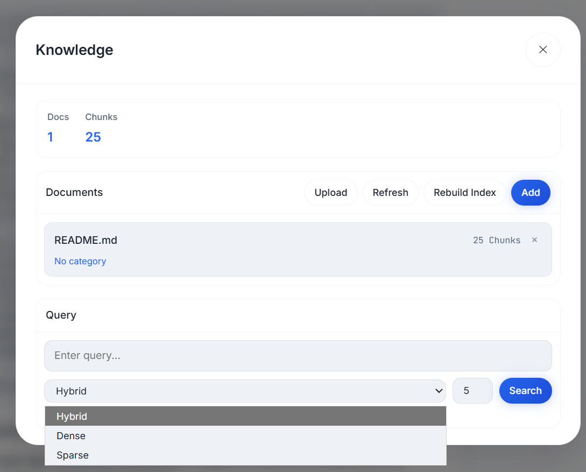
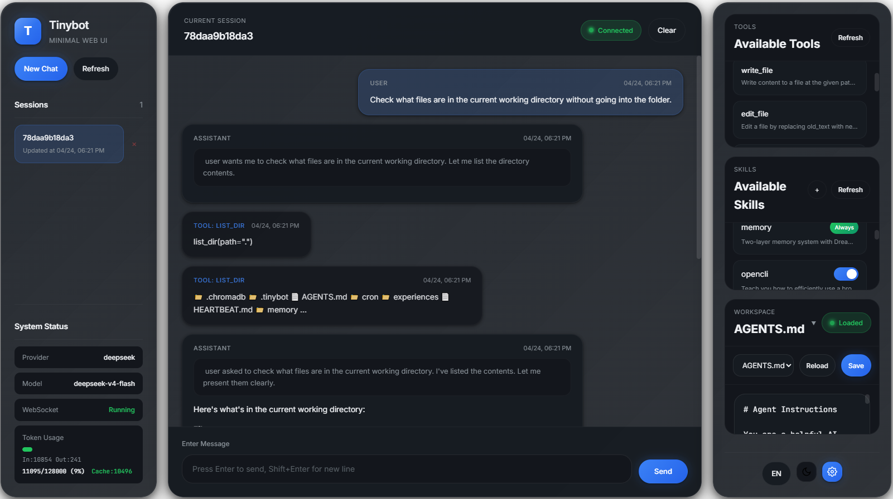

# Tinybot

<p align="center">
  
</p>

[](https://www.python.org/)
[](LICENSE)
[](https://github.com/SudoJacky/tinybot/stargazers)
[](https://github.com/SudoJacky/tinybot/issues)
[](https://github.com/SudoJacky/tinybot/releases)
[](https://oosmetrics.com/repo/SudoJacky/tinybot)

[中文文档](README_ZH.md) | [Quick Start](#quick-start) | [Features](#-core-highlights) | [Commands](#interactive-chat-commands)

A lightweight personal AI assistant framework that integrates Large Language Models with multiple chat platforms, tool systems, and automation mechanisms.

## Brand assets

- README logo: [`webui/assets/logo.svg`](webui/assets/logo.svg)
- Favicon / app mark: [`webui/assets/logo-mark.svg`](webui/assets/logo-mark.svg)
- Social preview source: [`webui/assets/social-preview.svg`](webui/assets/social-preview.svg)
- Installer icon source: use `webui/assets/logo.svg` for square app icons, or `webui/assets/logo-mark.svg` for compact launcher icons.

## Change log

<details>
<summary>2026.05.11 It significantly enhances the performance and presentation effect of cowork.</summary>



</details>

<details>
<summary>2026.05.08 Added a "cowork" capability, enabling the creation of an autonomous, multi-agent team system.</summary>
</details>

<details>
<summary>2026.05.07 Modified the display logic for tool usage.</summary>
</details>

<details>
<summary>2026.04.30 Fixed multiple UI issues, revised the browser control interface demonstration, and added task display functionality.</summary>





</details>

<details>
<summary>2026.04.29 Fixed multiple UI issues and added a browser control interface demonstration。</summary>


</details>

<details>
<summary>2026.04.28 Add beta RAG relation graph.</summary>




</details>

<details>
<summary>2026.04.27 Add docs and fix some issue.</summary>





</details>

<details>
<summary>2026.04.26 add RAG module, support text content for now</summary>


</details>

<details>
<summary>2026.04.24 new webui, human-create-skills, enable/disable skills,</summary>

white mode


dark mode


</details>


## ✨ Core Highlights

### Agent cowork!


### 🧠 Agentic DAG Task Scheduling


Automatically decomposes complex tasks into executable subtask DAGs, supporting:

- **Intelligent Decomposition** — LLM analyzes tasks and generates dependency-based subtask graphs
- **Automatic Chain Execution** — SubAgent completions automatically trigger dependent tasks
- **Parallel Execution** — Parallel-safe tasks run simultaneously for maximum efficiency
- **Dynamic Adjustment** — Add/remove subtasks during runtime

### WebUI


### 🔄 Experience Self-Evolution System

A self-learning system that continuously improves from problem-solving experiences:

~~~json
{
  "id": "exp_86788c0e",
  "timestamp": "2026-04-20T21:19:17",
  "tool_name": "exec",
  "error_type": "argument error",
  "error_message": "",
  "params": {},
  "outcome": "resolved",
  "resolution": "当使用opencli的scroll命令时，确保只传递一个参数，避免参数过多错误。检查命令调用格式，正确示例为`scroll(distance)`或`scroll(selector)`，而非多个参数。在工具调用前验证参数数量，可参考opencli文档或使用测试命令确认API要求。",
  "context_summary": "网页自动化执行：使用opencli执行JavaScript命令时参数错误和代码语法/类型错误，通过调整命令和防御性编程解决",
  "confidence": 0.7,
  "session_key": "cli:direct",
  "merged_count": 0,
  "last_used_at": "2026-04-20T21:19:17",
  "category": "api",
  "tags": ["opencli", "scroll", "参数错误", "浏览器自动化"],
  "use_count": 0,
  "success_count": 0,
  "feedback_positive": 0,
  "feedback_negative": 0
}
~~~

- **Semantic Experience Search** — Vector-based search understands problem intent, not just keywords
- **Auto Context Injection** — Relevant past solutions automatically appear when you need them
- **Proactive Error Diagnosis** — Tool failures trigger automatic suggestions from resolved experiences
- **Smart Confidence Model** — Multi-dimensional scoring: usage frequency, success rate, freshness, feedback
- **Automatic Categorization** — Experiences tagged by category (path, permission, encoding, network, etc.)

### 🤖 SubAgent Asynchronous Execution

- **Non-blocking Execution** — Background tasks don't block main conversation
- **Concurrency Control** — Configurable max concurrency to prevent overload
- **Heartbeat Monitoring** — Auto-detects timeout tasks, prevents zombie processes
- **Auto-notification** — Automatically triggers main Agent to summarize results when complete

### 💭 Dream Memory Processing

Two-phase autonomous memory consolidation during idle periods:

- **Phase 1: Analysis** — LLM analyzes conversation history, extracts insights
- **Phase 2: Editing** — AgentRunner makes targeted edits to memory files
- **Phase 3: Experience Update** — Merges similar experiences, updates strategy documents
- **Vector Storage Integration** — Semantic search across consolidated memories

### 📊 CLI Real-time Progress Display

Task execution shows real-time progress in CLI without disrupting main conversation

### ⚙️ Integrated Configuration Editor

Full-screen terminal configuration editor accessible directly within the interactive chat:

- Press `Ctrl+O` or type `/config` to open the editor
- No need to exit the chat session
- Edit provider settings, model parameters, tool configs, etc.
- Press `q` to save and return to chat

### 🔌 MCP (Model Context Protocol) Support

Connect to external MCP servers and use their tools seamlessly:

- **Native Tool Wrapping** — MCP tools appear as native tinybot tools
- **Multiple Server Support** — Connect to multiple MCP servers simultaneously
- **Auto Tool Discovery** — Automatically discovers and registers available tools

## 🚀 Basic Features

- **Multi-platform Integration** — Built-in WeChat, DingTalk, Feishu channels; plugin extensibility
- **Rich Tools** — File read/write, shell execution, browser automation, web search, scheduled tasks
- **Intelligent Memory** — Vector storage-based memory system with session integration and semantic search
- **Multi-LLM Support** — Compatible with OpenAI, DeepSeek, Zhipu, Qwen, Gemini, and 14+ providers
- **Skills System** — Define skills via Markdown files, teach Agent specific workflows without coding
- **Automation** — Cron scheduled tasks + heartbeat service for periodic auto-execution
- **OpenAI Compatible API** — Run as OpenAI-compatible backend service, integrate with any OpenAI client
- **Session Management** — Persistent conversation history with checkpoint recovery
- **Security** — Workspace restriction, command audit, encrypted credential storage

## Quick Start

```bash
# Install
uv sync

# Initialize configuration (interactive wizard)
uv run tinybot onboard

# Interactive chat mode
uv run tinybot agent

# Send single message
uv run tinybot agent -m "Hello"

# Start gateway (multi-channel + scheduled tasks + heartbeat)
uv run tinybot gateway

# Run as OpenAI-compatible API server
uv run tinybot api
```

## WebUI Usage

Tinybot provides a browser-based web interface for chatting with the AI agent.

### Steps to Enable WebUI

#### 1. Enable WebSocket Channel in Config

Edit your `~/.tinybot/config.json` file, add the following under `channels`:

```json
{
  "channels": {
    "websocket": {
      "enabled": true,
      "host": "127.0.0.1",
      "port": 18790
    }
  }
}
```

#### 2. Start the Gateway

```bash
uv run tinybot gateway
```

#### 3. Open Browser

Visit `http://127.0.0.1:18790` in your browser.

### Available API Endpoints

| Endpoint | Method | Description |
|----------|--------|-------------|
| `/api/sessions` | GET | List all chat sessions |
| `/api/sessions/{key}/messages` | GET | Get session messages |
| `/api/sessions/{key}` | DELETE/PATCH | Delete/update session |
| `/api/sessions/{key}/clear` | POST | Clear session history |
| `/api/sessions/{key}/profile` | GET | Get user profile |
| `/api/config` | GET/PATCH | Get/update configuration |
| `/api/status` | GET | Get system status |
| `/api/tools` | GET | Get available tools |
| `/api/skills` | GET | Get all skills |
| `/api/skills/{name}` | GET | Get skill detail |
| `/api/workspace/files` | GET | List workspace files |
| `/ws` | WebSocket | Real-time chat connection |

### WebSocket Events

| Event | Direction | Description |
|-------|-----------|-------------|
| `new_chat` | Client → Server | Create new chat |
| `attach` | Client → Server | Attach to existing chat |
| `message` | Client → Server | Send message |
| `interrupt` | Client → Server | Stop AI generation |
| `ping` | Client → Server | Heartbeat |
| `delta` | Server → Client | Streaming text chunk |
| `stream_end` | Server → Client | Stream finished |
| `message` | Server → Client | Full message |
| `file_updated` | Server → Client | Workspace file changed |

## Interactive Chat Commands

When in interactive mode, the following commands are available:

| Command | Description |
|---------|-------------|
| `/config` or `Ctrl+O` | Open configuration editor |
| `/help` | Show available commands |
| `/clear` | Clear conversation history |
| `/new` | Start new conversation session |
| `/exit` or `:q` | Exit the chat |

## Skills System

Define custom skills through simple Markdown files.

Skills are automatically loaded and the Agent follows defined workflows when conditions match.

### Before use browser

#### 1. Install OpenCLI

```bash
npm install -g @jackwener/opencli
```

#### 2. Install the Browser Bridge Extension

OpenCLI connects to Chrome/Chromium through a lightweight Browser Bridge extension plus a small local daemon. The daemon auto-starts when needed.

1. Download the latest `opencli-extension-v{version}.zip` from the GitHub [Releases page](https://github.com/jackwener/opencli/releases).
2. Unzip it, open `chrome://extensions`, and enable **Developer mode**.
3. Click **Load unpacked** and select the unzipped folder.

#### 3. Verify the setup

```bash
opencli doctor
```

## Experience Tools

The Agent can actively manage its learning experiences:

| Tool | Description |
|------|-------------|
| `query_experience` | Search past problem-solving experiences |
| `save_experience` | Save a new solution for future reference |
| `feedback_experience` | Mark an experience as helpful or not |
| `delete_experience` | Remove outdated or incorrect experiences |

## Requirements

- Python >= 3.13

## License

[MIT](LICENSE)
