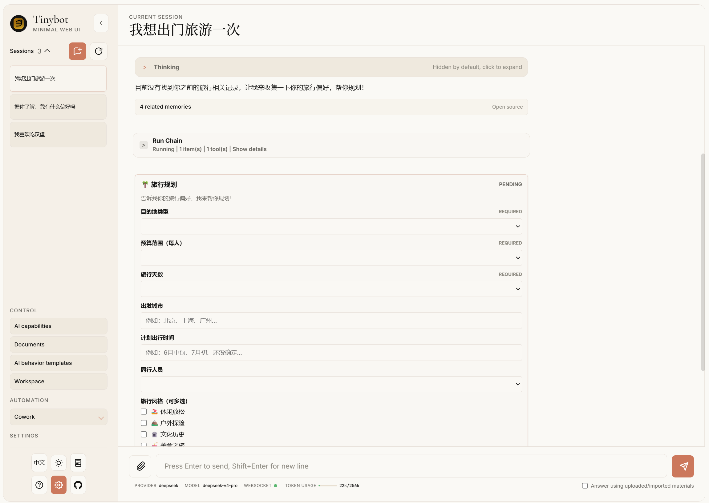
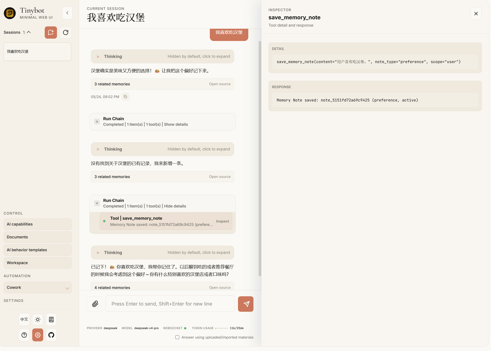
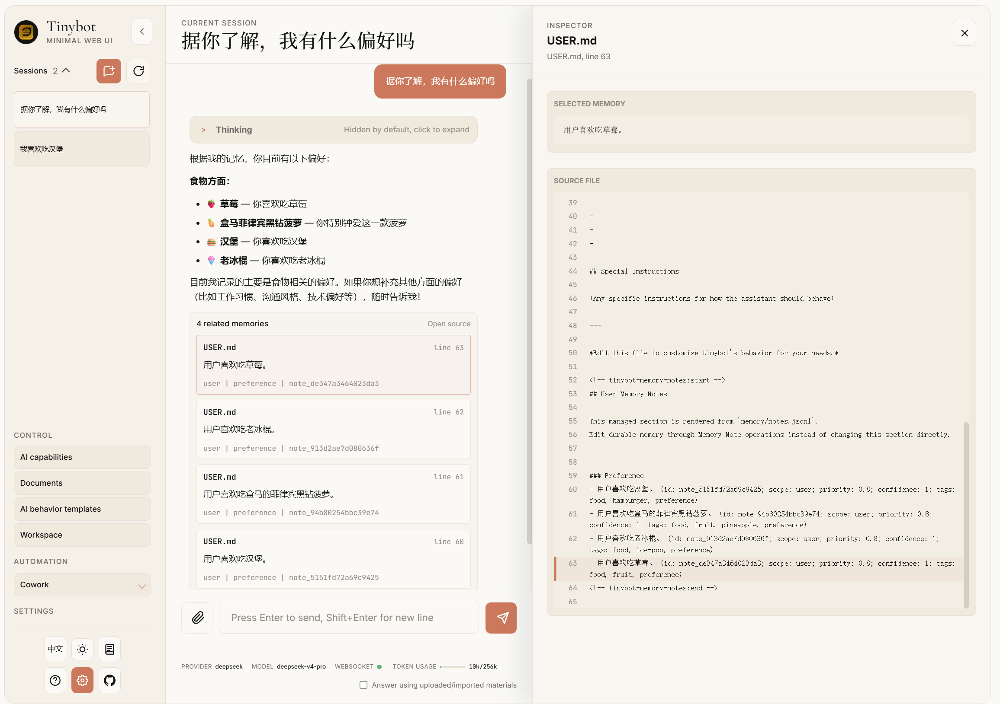
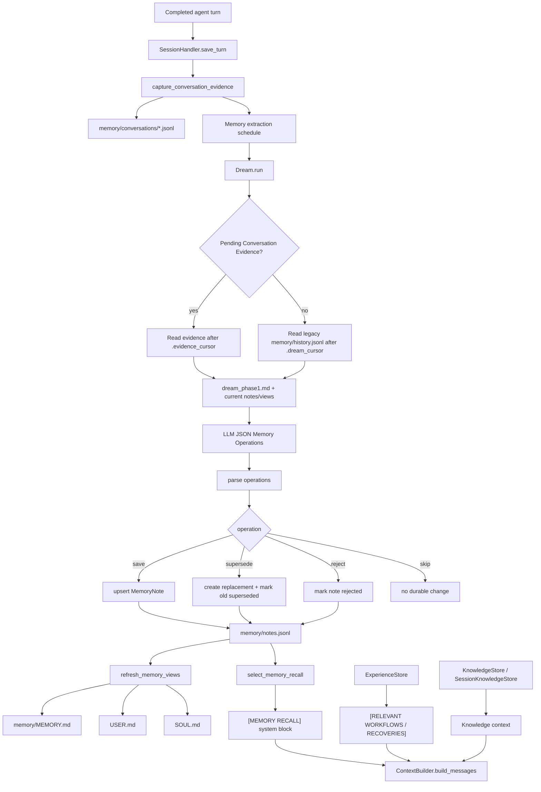
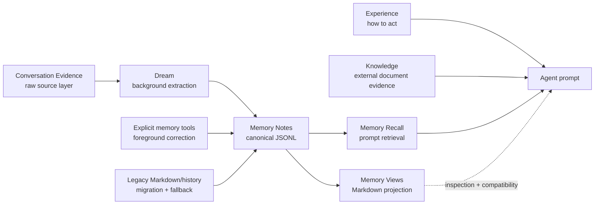
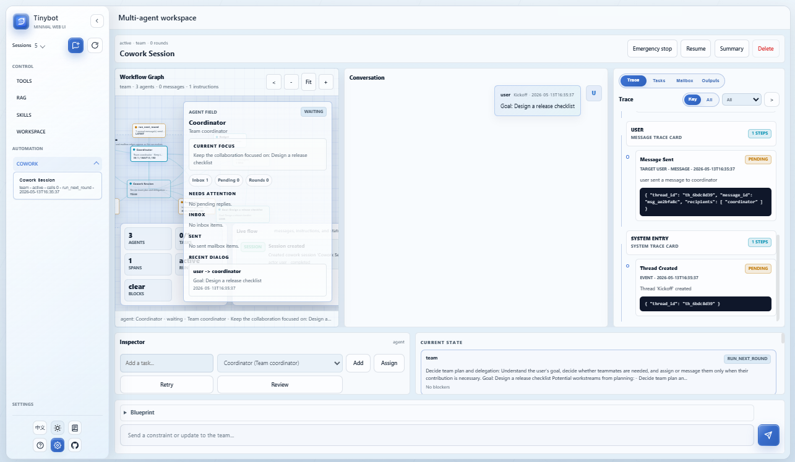
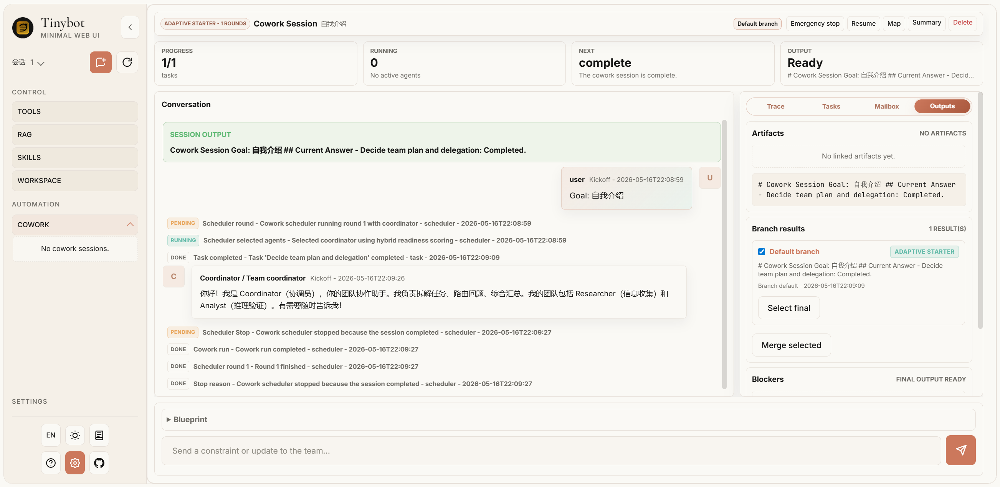
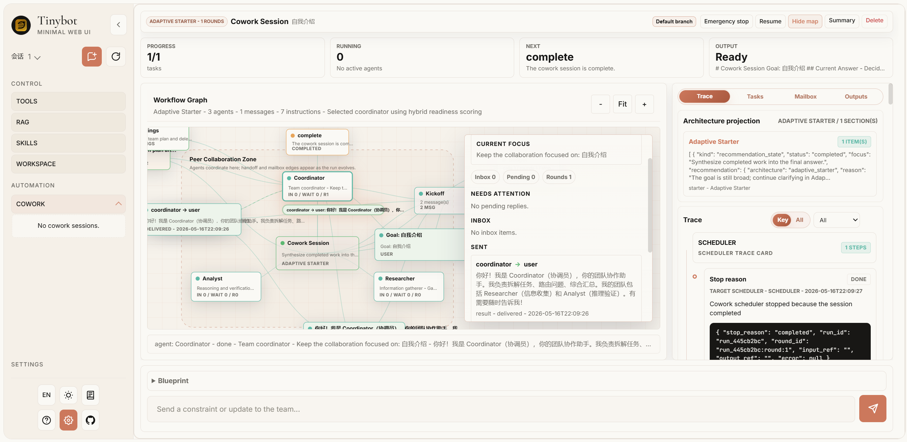

# Tinybot

<p align="center">
  
</p>

[](https://nodejs.org/)
[](https://www.rust-lang.org/)
[](https://tauri.app/)
[](LICENSE)
[](https://github.com/SudoJacky/tinybot/stargazers)
[](https://github.com/MShawon/github-clone-count-badge)
[](https://github.com/SudoJacky/tinybot/issues)
[](https://github.com/SudoJacky/tinybot/releases)
[](https://oosmetrics.com/repo/SudoJacky/tinybot)
[](https://deepwiki.com/SudoJacky/tinybot)

> **Python backend notice:** [0.0.18](https://github.com/SudoJacky/tinybot/releases/tag/0.0.18) is the last stable release that includes the Python backend.

[中文文档](README_ZH.md) | [Quick Start](#quick-start) | [Features](#-core-highlights) | [WebUI](#webui-usage)

A lightweight personal AI assistant framework that integrates Large Language Models with multiple chat platforms, tool systems, and automation mechanisms.

## Change log

<details>
<summary>2026.05.24 Event-oriented frontend components inspired by AG-UI, plus A2UI-style form collection when Tinybot needs follow-up information from the user.</summary>



</details>

<details>
<summary>2026.05.22 Implemented an efficient, real-time, editable memory system maintained alongside the agent, using memory state labels to handle contradictory memories over time.</summary>









</details>

<details>
<summary>2026.05.15 Continued Cowork architecture runtime evolution.</summary>

Cowork now uses canonical architectures (`adaptive_starter`, `team`, `generator_verifier`, `message_bus`, `shared_state`, `swarm`), branch-aware session snapshots, Agent Step observation detail expansion, architecture-specific projections, and explicit branch result selection or merge controls.

</details>

<details>
<summary>2026.05.13 Evolved Cowork into a graph-driven, blueprint-aware agent swarm control plane.</summary>

Cowork now exposes versioned graph/trace snapshots, reusable JSON blueprints, budget-aware run controls, blocker panels, blueprint validation/preview APIs.



</details>

<details>
<summary>2026.05.11 It significantly enhances the performance and presentation effect of cowork.</summary>


</details>

<details>
<summary>2026.05.08 Added a "cowork" capability, enabling the creation of an autonomous, multi-agent team system.</summary>
</details>

<details>
<summary>2026.05.07 Modified the display logic for tool usage.</summary>
</details>

<details>
<summary>2026.04.30 Fixed multiple UI issues, revised the browser control interface demonstration, and added task display functionality.</summary>


</details>

<details>
<summary>2026.04.29 Fixed multiple UI issues and added a browser control interface demonstration。</summary>


</details>

<details>
<summary>2026.04.28 Add beta RAG relation graph.</summary>


</details>

<details>
<summary>2026.04.27 Add docs and fix some issue.</summary>


</details>

<details>
<summary>2026.04.26 add RAG module, support text content for now</summary>


</details>

<details>
<summary>2026.04.24 new webui, human-create-skills, enable/disable skills,</summary>

white mode


dark mode


</details>


## ✨ Core Highlights

### Interactive Forms

<video src="https://github.com/user-attachments/assets/d788bf1f-e70f-47be-869c-db1bf44d2d64" controls width="100%"></video>

### Chatbot-agent

<video src="https://github.com/user-attachments/assets/6b2e9439-7870-440e-8c49-61d38d46caf9" controls width="100%"></video>


### Agent cowork!

Cowork provides a shared multi-agent session model with architecture runtime policies, branch navigation, architecture-specific projections, observable Agent Steps, and explicit final-result selection.





### 🧠 Agentic DAG Task Scheduling


Automatically decomposes complex tasks into executable subtask DAGs, supporting:

- **Intelligent Decomposition** — LLM analyzes tasks and generates dependency-based subtask graphs
- **Automatic Chain Execution** — SubAgent completions automatically trigger dependent tasks
- **Parallel Execution** — Parallel-safe tasks run simultaneously for maximum efficiency
- **Dynamic Adjustment** — Add/remove subtasks during runtime

### WebUI


### 🔄 Experience Self-Evolution System

A self-learning system that continuously improves from problem-solving experiences:

~~~json
{
  "id": "exp_86788c0e",
  "timestamp": "2026-04-20T21:19:17",
  "tool_name": "exec",
  "error_type": "argument error",
  "error_message": "",
  "params": {},
  "outcome": "resolved",
  "resolution": "When using the opencli scroll command, pass exactly one argument to avoid argument-count errors. Check the command call format; valid examples are `scroll(distance)` or `scroll(selector)`, not multiple arguments. Validate argument counts before tool calls, using the opencli documentation or a test command to confirm API requirements.",
  "context_summary": "Browser automation: fixed argument errors and JavaScript syntax/type errors while using opencli by adjusting commands and adding defensive handling.",
  "confidence": 0.7,
  "session_key": "cli:direct",
  "merged_count": 0,
  "last_used_at": "2026-04-20T21:19:17",
  "category": "api",
  "tags": ["opencli", "scroll", "argument-error", "browser-automation"],
  "use_count": 0,
  "success_count": 0,
  "feedback_positive": 0,
  "feedback_negative": 0
}
~~~

- **Semantic Experience Search** — Vector-based search understands problem intent, not just keywords
- **Auto Context Injection** — Relevant past solutions automatically appear when you need them
- **Proactive Error Diagnosis** — Tool failures trigger automatic suggestions from resolved experiences
- **Smart Confidence Model** — Multi-dimensional scoring: usage frequency, success rate, freshness, feedback
- **Automatic Categorization** — Experiences tagged by category (path, permission, encoding, network, etc.)

### 🤖 SubAgent Asynchronous Execution

- **Non-blocking Execution** — Background tasks don't block main conversation
- **Concurrency Control** — Configurable max concurrency to prevent overload
- **Heartbeat Monitoring** — Auto-detects timeout tasks, prevents zombie processes
- **Auto-notification** — Automatically triggers main Agent to summarize results when complete

### 💭 Dream Memory Processing

Two-phase autonomous memory consolidation during idle periods:

- **Phase 1: Analysis** — LLM analyzes conversation history, extracts insights
- **Phase 2: Editing** — AgentRunner makes targeted edits to memory files
- **Phase 3: Experience Update** — Merges similar experiences, updates strategy documents
- **Vector Storage Integration** — Semantic search across consolidated memories

### 📊 Desktop Task Progress

Task execution shows real-time progress in the desktop WebUI without disrupting the main conversation.

### ⚙️ Integrated Configuration Editor

Configuration is managed directly in the desktop settings surface:

- Edit provider settings, model parameters, tool configs, knowledge settings, and runtime options.
- Changes are applied through the Rust native backend.
- No separate terminal chat session is required.

### 🔌 MCP (Model Context Protocol) Support

Connect to external MCP servers and use their tools seamlessly:

- **Native Tool Wrapping** — MCP tools appear as native tinybot tools
- **Multiple Server Support** — Connect to multiple MCP servers simultaneously
- **Auto Tool Discovery** — Automatically discovers and registers available tools

## 🚀 Basic Features

- **Multi-platform Integration** — Built-in WeChat, DingTalk, Feishu channels; plugin extensibility
- **Rich Tools** — File read/write, shell execution, browser automation, web search, scheduled tasks
- **Intelligent Memory** — Vector storage-based memory system with session integration and semantic search
- **Multi-LLM Support** — Compatible with OpenAI, DeepSeek, Zhipu, Qwen, Gemini, and 14+ providers
- **Skills System** — Define skills via Markdown files, teach Agent specific workflows without coding
- **Automation** — Cron scheduled tasks + heartbeat service for periodic auto-execution
- **OpenAI-compatible Runtime Route** — The desktop runtime exposes `/v1/chat/completions` for WebUI-compatible chat dispatch
- **Session Management** — Persistent conversation history with checkpoint recovery
- **Security** — Workspace restriction, command audit, encrypted credential storage

## Quick Start

```bash
# Install dependencies
npm install

# Run frontend checks
npm test
npm run build

# Start the Tauri desktop app with the Rust native backend
npm run tauri -- dev

# Build a desktop package
npm run tauri -- build
```

## WebUI Usage

Tinybot now runs the WebUI inside the Tauri desktop app. The Rust native backend exposes WebUI-compatible routes on the local runtime endpoint used by the desktop shell.

### Steps to Open WebUI

#### 1. Start the Desktop App

```bash
npm run tauri -- dev
```

#### 2. Use the Desktop WebUI

The desktop shell starts the Rust native backend and loads the WebUI surface automatically. Runtime status is available from the Gateway & Runtime panel.

### Available API Endpoints

| Endpoint | Method | Description |
|----------|--------|-------------|
| `/api/sessions` | GET | List all chat sessions |
| `/api/sessions/{key}/messages` | GET | Get session messages |
| `/api/sessions/{key}` | DELETE/PATCH | Delete/update session |
| `/api/sessions/{key}/clear` | POST | Clear session history |
| `/api/sessions/{key}/profile` | GET | Get user profile |
| `/api/config` | GET/PATCH | Get/update configuration |
| `/api/status` | GET | Get system status |
| `/api/tools` | GET | Get available tools |
| `/api/skills` | GET | Get all skills |
| `/api/skills/{name}` | GET | Get skill detail |
| `/api/workspace/files` | GET | List workspace files |
| `/ws` | WebSocket | Real-time chat connection |

### WebSocket Events

| Event | Direction | Description |
|-------|-----------|-------------|
| `new_chat` | Client → Server | Create new chat |
| `attach` | Client → Server | Attach to existing chat |
| `message` | Client → Server | Send message |
| `interrupt` | Client → Server | Stop AI generation |
| `ping` | Client → Server | Heartbeat |
| `delta` | Server → Client | Streaming text chunk |
| `stream_end` | Server → Client | Stream finished |
| `message` | Server → Client | Full message |
| `file_updated` | Server → Client | Workspace file changed |

## Desktop WebUI Controls

Use the desktop WebUI for day-to-day operation:

| Surface | Description |
|---------|-------------|
| Chat composer | Send messages, attach files, stop generation, and switch sessions |
| Settings | Configure providers, models, tools, knowledge, channels, and runtime options |
| Gateway & Runtime | View local runtime readiness, endpoint status, and compatibility-worker state |
| Tools / Skills / Knowledge | Inspect tools, manage skills, and operate the local knowledge base |

## Skills System

Define custom skills through simple Markdown files.

Skills are automatically loaded and the Agent follows defined workflows when conditions match.

### Before use browser

#### 1. Install OpenCLI

```bash
npm install -g @jackwener/opencli
```

#### 2. Install the Browser Bridge Extension

OpenCLI connects to Chrome/Chromium through a lightweight Browser Bridge extension plus a small local daemon. The daemon auto-starts when needed.

1. Download the latest `opencli-extension-v{version}.zip` from the GitHub [Releases page](https://github.com/jackwener/opencli/releases).
2. Unzip it, open `chrome://extensions`, and enable **Developer mode**.
3. Click **Load unpacked** and select the unzipped folder.

#### 3. Verify the setup

```bash
opencli doctor
```

## Experience Tools

The Agent can actively manage its learning experiences:

| Tool | Description |
|------|-------------|
| `query_experience` | Search past problem-solving experiences |
| `save_experience` | Save a new solution for future reference |
| `feedback_experience` | Mark an experience as helpful or not |
| `delete_experience` | Remove outdated or incorrect experiences |

## Requirements

- Node.js 22
- Rust stable toolchain
- Tauri 2 prerequisites for your platform

## License

[MIT](LICENSE)
