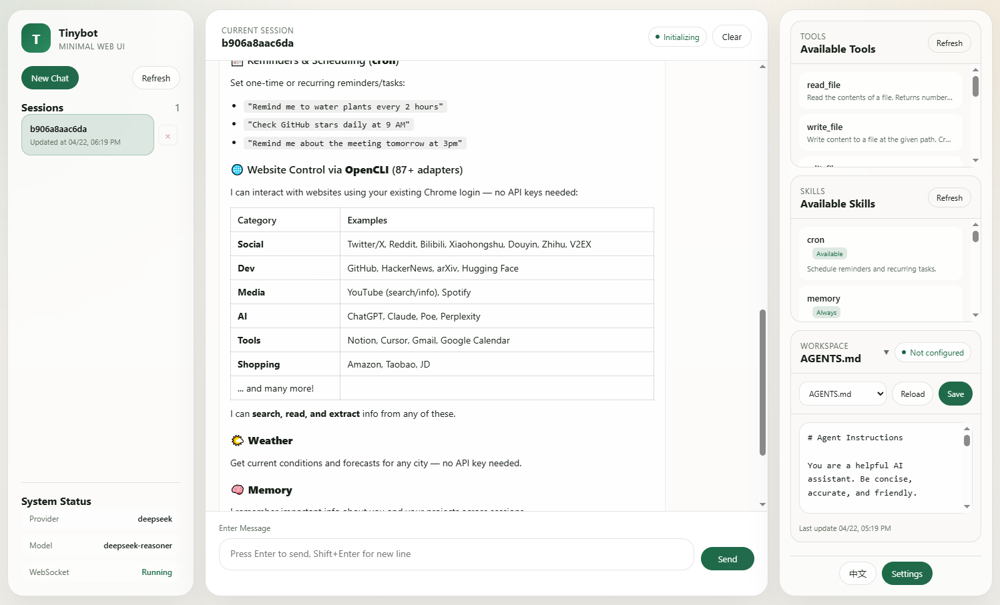

# Tinybot

[](https://www.python.org/)
[](LICENSE)
[](https://github.com/SudoJacky/tinybot/stargazers)
[](https://github.com/SudoJacky/tinybot/issues)
[](https://github.com/SudoJacky/tinybot/releases)

[English](README.md) | [快速开始](#快速开始) | [特性](#-核心亮点) | [命令](#交互聊天命令)

一个轻量的个人 AI 助手框架，将大语言模型与多种聊天平台、工具系统和自动化机制集成在一起。

## ✨ 核心亮点

### 🧠 Agentic DAG 任务调度


自动将复杂任务分解为可执行的子任务 DAG，支持：

- **智能分解** — LLM 自动分析任务，生成带依赖关系的子任务图
- **自动链式执行** — SubAgent 完成后自动触发依赖任务，无需人工干预
- **并行执行** — 并行安全的任务同时运行，最大化效率
- **动态调整** — 运行中可添加/移除子任务，灵活应对变化

### WebUI



### 🔄 经验自进化系统

持续从问题解决经验中学习的自学习系统：

~~~json
{
  "id": "exp_86788c0e",
  "timestamp": "2026-04-20T21:19:17",
  "tool_name": "exec",
  "error_type": "argument error",
  "error_message": "",
  "params": {},
  "outcome": "resolved",
  "resolution": "当使用opencli的scroll命令时，确保只传递一个参数，避免参数过多错误。检查命令调用格式，正确示例为`scroll(distance)`或`scroll(selector)`，而非多个参数。在工具调用前验证参数数量，可参考opencli文档或使用测试命令确认API要求。",
  "context_summary": "网页自动化执行：使用opencli执行JavaScript命令时参数错误和代码语法/类型错误，通过调整命令和防御性编程解决",
  "confidence": 0.7,
  "session_key": "cli:direct",
  "merged_count": 0,
  "last_used_at": "2026-04-20T21:19:17",
  "category": "api",
  "tags": ["opencli", "scroll", "参数错误", "浏览器自动化"],
  "use_count": 0,
  "success_count": 0,
  "feedback_positive": 0,
  "feedback_negative": 0
}
~~~

- **语义经验搜索** — 向量搜索理解问题意图，而非仅匹配关键词
- **自动上下文注入** — 相关历史解决方案在需要时自动出现
- **主动错误诊断** — 工具失败时自动触发已解决经验的建议
- **智能置信度模型** — 多维评分：使用频率、成功率、时效性、反馈记录
- **自动分类标签** — 经验按问题类别标记（路径、权限、编码、网络等）

### 🤖 SubAgent 异步执行系统

- **非阻塞执行** — 后台任务不阻塞主对话，用户可继续交互
- **并发控制** — 可配置最大并发数，防止资源过载
- **心跳监控** — 自动检测超时任务，防止僵尸进程
- **自动通知** — 任务完成时自动触发主 Agent 汇总结果

### 💭 Dream 记忆处理

空闲时段的两阶段自主记忆整理：

- **阶段一：分析** — LLM 分析对话历史，提取洞察
- **阶段二：编辑** — AgentRunner 对记忆文件进行定向编辑
- **阶段三：经验更新** — 合并相似经验，更新策略文档
- **向量存储集成** — 跨整理记忆的语义搜索

### 📊 CLI 实时进度显示

任务执行时 CLI 实时显示进度，不干扰主对话流

### ⚙️ 内置配置编辑器

全屏终端配置编辑器，可直接在交互聊天界面中访问：

- 按 `Ctrl+O` 或输入 `/config` 打开编辑器
- 无需退出聊天会话
- 编辑提供商设置、模型参数、工具配置等
- 按 `q` 保存并返回聊天

### 🔌 MCP (Model Context Protocol) 支持

连接外部 MCP 服务器并无缝使用其工具：

- **原生工具包装** — MCP 工具以原生 tinybot 工具形式呈现
- **多服务器支持** — 同时连接多个 MCP 服务器
- **自动工具发现** — 自动发现并注册可用工具

## 🚀 基础特性

- **多平台接入** — 内置微信、钉钉、飞书频道，支持插件扩展
- **丰富的工具** — 文件读写、Shell 执行、浏览器自动化、网页搜索、定时任务等
- **智能记忆** — 基于向量存储的记忆系统，支持会话整合与语义搜索
- **多 LLM 支持** — 兼容 OpenAI、DeepSeek、智谱、通义千问、Gemini 等 14+ 家提供商
- **Skills 系统** — 通过 Markdown 文件定义技能，无需编码即可让 Agent 学会特定工作流
- **自动化** — 定时任务（Cron）+ 心跳服务，周期性自动执行任务
- **OpenAI 兼容 API** — 可作为 OpenAI 兼容后端服务运行，与任何 OpenAI 客户端集成
- **会话管理** — 持久化对话历史，支持断点恢复
- **安全机制** — 工作区限制、命令审计、加密凭证存储

## 快速开始

```bash
# 安装
uv sync

# 初始化配置（交互式向导）
uv run tinybot onboard

# 交互聊天模式
uv run tinybot agent

# 发送单条消息
uv run tinybot agent -m "你好"

# 启动网关（多频道 + 定时任务 + 心跳）
uv run tinybot gateway

# 作为 OpenAI 兼容 API 服务运行
uv run tinybot api
```

## WebUI 使用指南

Tinybot 提供浏览器网页界面，可直接与 AI 助手对话。

### 启用 WebUI 的步骤

#### 1. 在配置文件中启用 WebSocket 频道

编辑 `~/.tinybot/config.json` 文件，在 `channels` 下添加：

```json
{
  "channels": {
    "websocket": {
      "enabled": true,
      "host": "127.0.0.1",
      "port": 18790
    }
  }
}
```

#### 2. 启动 Gateway

```bash
uv run tinybot gateway
```

#### 3. 打开浏览器

访问 `http://127.0.0.1:18790`

### 可用的 API 接口

| 接口 | 方法 | 说明 |
|------|------|------|
| `/api/sessions` | GET | 获取所有聊天会话 |
| `/api/sessions/{key}/messages` | GET | 获取会话消息 |
| `/api/sessions/{key}` | DELETE/PATCH | 删除/更新会话 |
| `/api/sessions/{key}/clear` | POST | 清空会话历史 |
| `/api/sessions/{key}/profile` | GET | 获取用户画像 |
| `/api/config` | GET/PATCH | 获取/更新配置 |
| `/api/status` | GET | 获取系统状态 |
| `/api/tools` | GET | 获取可用工具列表 |
| `/api/skills` | GET | 获取所有技能 |
| `/api/skills/{name}` | GET | 获取技能详情 |
| `/api/workspace/files` | GET | 列出工作区文件 |
| `/ws` | WebSocket | 实时聊天连接 |

### WebSocket 事件

| 事件 | 方向 | 说明 |
|------|------|------|
| `new_chat` | 客户端 → 服务端 | 创建新聊天 |
| `attach` | 客户端 → 服务端 | 加入已有聊天 |
| `message` | 客户端 → 服务端 | 发送消息 |
| `interrupt` | 客户端 → 服务端 | 停止 AI 生成 |
| `ping` | 客户端 → 服务端 | 心跳检测 |
| `delta` | 服务端 → 客户端 | 流式文本片段 |
| `stream_end` | 服务端 → 客户端 | 流式输出结束 |
| `message` | 服务端 → 客户端 | 完整消息 |
| `file_updated` | 服务端 → 客户端 | 工作区文件变更 |

## 交互聊天命令

在交互模式下，支持以下命令：

| 命令 | 说明 |
|------|------|
| `/config` 或 `Ctrl+O` | 打开配置编辑器 |
| `/help` | 显示可用命令 |
| `/clear` | 清除对话历史 |
| `/new` | 开始新对话会话 |
| `/exit` 或 `:q` | 退出聊天 |

## Skills 技能系统

通过简单的 Markdown 文件定义自定义技能

技能自动加载，当条件匹配时 Agent 会遵循定义的工作流。

### 使用浏览器之前

#### 1. 安装 OpenCLI

```bash
npm install -g @jackwener/opencli
```

#### 2. 安装chrome拓展

OpenCLI 通过一个轻量级的浏览器桥接扩展程序和一个小型本地守护进程连接到 Chrome/Chromium。该守护进程会在需要时自动启动。

1. 从 GitHub 下载最新版本的 `opencli-extension-v{version}.zip` [Releases page](https://github.com/jackwener/opencli/releases).
2. 解压，打开 `chrome://extensions`，然后启用**开发者模式**.
3. 点击“加载已解压文件”并选择已解压的文件夹.

#### 3. 验证设置

```bash
opencli doctor
```

## 经验管理工具

Agent 可以主动管理其学习经验：

| 工具 | 说明 |
|------|------|
| `query_experience` | 搜索过去的问题解决经验 |
| `save_experience` | 保存新的解决方案供未来参考 |
| `feedback_experience` | 标记经验是否有帮助 |
| `delete_experience` | 移除过时或错误的经验 |

## 环境要求

- Python >= 3.13

## 许可证

[MIT](LICENSE)
