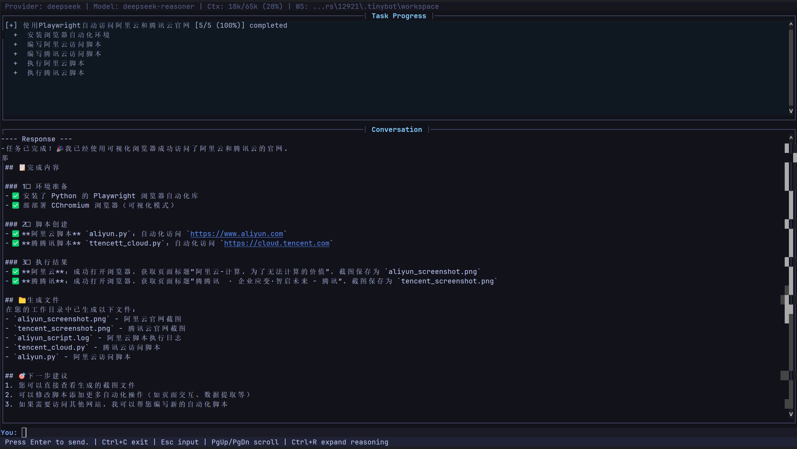

# Tinybot

[](https://www.python.org/)
[](LICENSE)
[](https://github.com/SudoJacky/tinybot/stargazers)
[](https://github.com/SudoJacky/tinybot/issues)
[](https://github.com/SudoJacky/tinybot/releases)

[English](README.md) | [快速开始](#快速开始) | [特性](#-基础特性) | [命令](#交互聊天命令)

一个轻量的个人 AI 助手框架，将大语言模型与多种聊天平台、工具系统和自动化机制集成在一起。

## ✨ 核心亮点

### 🧠 Agentic DAG 任务调度



自动将复杂任务分解为可执行的子任务 DAG，支持：

- **智能分解** — LLM 自动分析任务，生成带依赖关系的子任务图
- **自动链式执行** — SubAgent 完成后自动触发依赖任务，无需人工干预
- **并行执行** — 并行安全的任务同时运行，最大化效率
- **动态调整** — 运行中可添加/移除子任务，灵活应对变化

### 🤖 SubAgent 异步执行系统

- **非阻塞执行** — 后台任务不阻塞主对话，用户可继续交互
- **并发控制** — 可配置最大并发数，防止资源过载
- **心跳监控** — 自动检测超时任务，防止僵尸进程
- **自动通知** — 任务完成时自动触发主 Agent 汇总结果

### 📊 CLI 实时进度显示

任务执行时 CLI 实时显示进度，不干扰主对话流：

```
=== 调研三大云服务商 [3/5] ===
  ✅ 环境准备与依赖安装
  ▶️ 访问华为云并收集信息
  ▶️ 访问阿里云并收集信息
  ⏳ 访问腾讯云并收集信息
  ⏳ 汇总与整理结果
================================
```

### ⚙️ 内置配置编辑器

全屏终端配置编辑器，可直接在交互聊天界面中访问：

- 按 `Ctrl+O` 或输入 `/config` 打开编辑器
- 无需退出聊天会话
- 编辑提供商设置、模型参数、工具配置等
- 按 `q` 保存并返回聊天

## 🚀 基础特性

- **多平台接入** — 内置微信、钉钉、飞书频道，支持插件扩展
- **丰富的工具** — 文件读写、Shell 执行、浏览器自动化、网页搜索、定时任务等
- **智能记忆** — 基于向量存储的记忆系统，支持会话整合与语义搜索
- **多 LLM 支持** — 兼容 OpenAI、DeepSeek、智谱、通义千问、Gemini 等 14+ 家提供商
- **自动化** — 定时任务（Cron）+ 心跳服务，周期性自动执行任务
- **OpenAI 兼容 API** — 可作为 OpenAI 兼容后端服务运行
- **Skills 系统** — 通过 Markdown 文件定义技能，让 Agent 学会特定工作流

## 快速开始

```bash
# 安装
uv sync

# 初始化配置（交互式向导）
uv run tinybot onboard

# 交互聊天模式
uv run tinybot agent

# 发送单条消息
uv run tinybot agent -m "你好"

# 启动网关（多频道 + 定时任务 + 心跳）
uv run tinybot gateway
```

## 交互聊天命令

在交互模式下，支持以下命令：

| 命令 | 说明 |
|------|------|
| `/config` 或 `Ctrl+O` | 打开配置编辑器 |
| `/help` | 显示可用命令 |
| `/clear` | 清除对话历史 |
| `/exit` 或 `:q` | 退出聊天 |

## 环境要求

- Python >= 3.13

## 许可证

[MIT](LICENSE)
