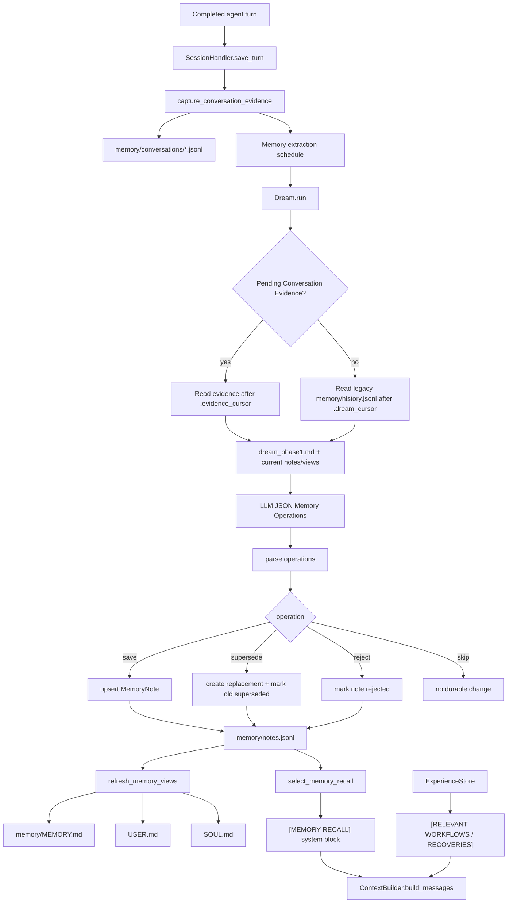
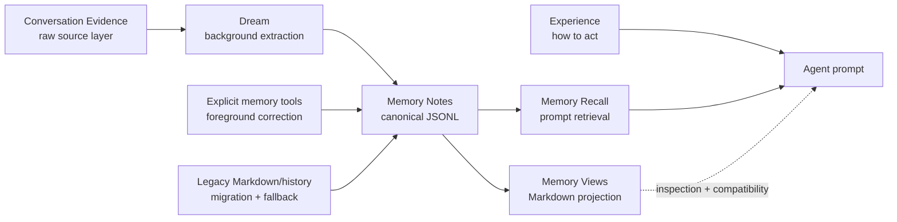

# Tinybot

<p align="center">
  
</p>

[](https://nodejs.org/)
[](https://www.rust-lang.org/)
[](https://tauri.app/)
[](LICENSE)
[](https://github.com/SudoJacky/tinybot/stargazers)
[](https://github.com/MShawon/github-clone-count-badge)
[](https://github.com/SudoJacky/tinybot/issues)
[](https://github.com/SudoJacky/tinybot/releases)
[](https://oosmetrics.com/repo/SudoJacky/tinybot)
[](https://deepwiki.com/SudoJacky/tinybot)

> **Python 后端提示：**[0.0.18](https://github.com/SudoJacky/tinybot/releases/tag/0.0.18) 是最后一个包含 Python 后端的稳定版本。

[English](README.md) | [快速开始](#快速开始) | [核心亮点](#-核心亮点) | [WebUI](#webui-使用)

Tinybot 是一个轻量级个人 AI 助手框架，集成了大语言模型、多种聊天平台、工具系统和自动化机制。

## 变更日志

<details>
<summary>2026.05.24 依照AG-UI思想，将前端组件事件化；依照A2UI思想，现在当Tinybot需要继续询问用户以收集类似表单格式的信息时，会采用表单的界面进行收集。</summary>


</details>

<details>
<summary>2026.05.22 实现了一套高效，实时，可修改，与本体并行维护的记忆系统，并通过维护记忆状态标签，处理存在前后矛盾的记忆信息。</summary>






</details>

<details>
<summary>2026.05.15 持续演进 Cowork 架构运行时。</summary>

Cowork 现在使用规范化架构（`adaptive_starter`、`team`、`generator_verifier`、`message_bus`、`shared_state`、`swarm`），支持分支感知的会话快照、Agent Step 观察详情扩展、架构专属投影，以及显式的分支结果选择或合并控制。

</details>

<details>
<summary>2026.05.13 将 Cowork 演进为图驱动、蓝图感知的 Agent 群体控制平面。</summary>

Cowork 现在提供版本化的图/轨迹快照、可复用 JSON 蓝图、预算感知运行控制、阻塞面板，以及蓝图校验/预览 API。


</details>

<details>
<summary>2026.05.11 显著增强 Cowork 的性能和呈现效果。</summary>


</details>

<details>
<summary>2026.05.08 新增 “cowork” 能力，可创建自主运行的多 Agent 团队系统。</summary>
</details>

<details>
<summary>2026.05.07 修改工具使用的展示逻辑。</summary>
</details>

<details>
<summary>2026.04.30 修复多个 UI 问题，修订浏览器控制界面演示，并新增任务展示功能。</summary>


</details>

<details>
<summary>2026.04.29 修复多个 UI 问题，并新增浏览器控制界面演示。</summary>


</details>

<details>
<summary>2026.04.27 新增文档并修复部分问题。</summary>


</details>

<details>
<summary>2026.04.24 新增 WebUI、人工创建 skills、启用/禁用 skills 等能力。</summary>

浅色模式


深色模式


</details>

## ✨ 核心亮点

### 交互式表单

<video src="https://github.com/user-attachments/assets/d788bf1f-e70f-47be-869c-db1bf44d2d64" controls width="100%"></video>

### Chatbot-agent

<video src="https://github.com/user-attachments/assets/6b2e9439-7870-440e-8c49-61d38d46caf9" controls width="100%"></video>

### Agent cowork!

Cowork 提供共享的多 Agent 会话模型，包含架构运行时策略、分支导航、架构专属投影、可观察的 Agent Steps，以及显式的最终结果选择。


### 🧠 Agentic DAG 任务调度


自动将复杂任务拆解为可执行的子任务 DAG，支持：

- **智能拆解** - LLM 分析任务并生成基于依赖关系的子任务图
- **自动链式执行** - SubAgent 完成后自动触发依赖它的任务
- **并行执行** - 可安全并行的任务会同时运行，以获得更高效率
- **动态调整** - 运行过程中可添加或移除子任务

### WebUI


### 🔄 经验自进化系统

一个可以从问题解决经验中持续改进的自学习系统：

~~~json
{
  "id": "exp_86788c0e",
  "timestamp": "2026-04-20T21:19:17",
  "tool_name": "exec",
  "error_type": "argument error",
  "error_message": "",
  "params": {},
  "outcome": "resolved",
  "resolution": "当使用opencli的scroll命令时，确保只传递一个参数，避免参数过多错误。检查命令调用格式，正确示例为`scroll(distance)`或`scroll(selector)`，而非多个参数。在工具调用前验证参数数量，可参考opencli文档或使用测试命令确认API要求。",
  "context_summary": "网页自动化执行：使用opencli执行JavaScript命令时参数错误和代码语法/类型错误，通过调整命令和防御性编程解决",
  "confidence": 0.7,
  "session_key": "cli:direct",
  "merged_count": 0,
  "last_used_at": "2026-04-20T21:19:17",
  "category": "api",
  "tags": ["opencli", "scroll", "参数错误", "浏览器自动化"],
  "use_count": 0,
  "success_count": 0,
  "feedback_positive": 0,
  "feedback_negative": 0
}
~~~

- **语义经验搜索** - 基于向量的搜索能理解问题意图，而不只是匹配关键词
- **自动上下文注入** - 相关历史解决方案会在需要时自动出现
- **主动错误诊断** - 工具失败时，会自动从已解决经验中给出建议
- **智能置信度模型** - 多维度评分：使用频率、成功率、新鲜度、反馈
- **自动分类** - 按类别为经验打标签（路径、权限、编码、网络等）

### 🤖 SubAgent 异步执行

- **非阻塞执行** - 后台任务不会阻塞主对话
- **并发控制** - 可配置最大并发数，避免过载
- **心跳监控** - 自动检测超时任务，避免残留进程
- **自动通知** - 任务完成后自动触发主 Agent 总结结果

### 💭 Dream 记忆处理

空闲期间进行两阶段自主记忆整合：

- **阶段 1：分析** - LLM 分析对话历史并提取洞察
- **阶段 2：编辑** - AgentRunner 对记忆文件进行定向编辑
- **阶段 3：经验更新** - 合并相似经验并更新策略文档
- **向量存储集成** - 在整合后的记忆中进行语义搜索

### 📊 桌面任务进度

任务执行会在桌面 WebUI 中实时显示进度，同时不打断主对话。

### ⚙️ 集成配置编辑器

配置现在直接在桌面设置界面中管理：

- 编辑 provider 设置、模型参数、工具配置、知识库设置和运行时选项。
- 配置变更通过 Rust 原生后端应用。
- 不再需要单独进入终端聊天会话。

### 🔌 MCP（Model Context Protocol）支持

无缝连接外部 MCP server 并使用其工具：

- **原生工具封装** - MCP 工具会表现为 tinybot 原生工具
- **多 Server 支持** - 可同时连接多个 MCP server
- **自动工具发现** - 自动发现并注册可用工具

## 🚀 基础功能

- **多平台集成** - 内置微信、钉钉、飞书渠道，并支持插件扩展
- **丰富工具** - 文件读写、shell 执行、浏览器自动化、网页搜索、定时任务
- **智能记忆** - 基于向量存储的记忆系统，集成会话并支持语义搜索
- **多 LLM 支持** - 兼容 OpenAI、DeepSeek、智谱、通义千问、Gemini 以及 14+ provider
- **Skills 系统** - 通过 Markdown 文件定义 skills，无需编码即可教会 Agent 特定工作流
- **自动化** - Cron 定时任务 + heartbeat 服务，用于周期性自动执行
- **OpenAI 兼容运行时路由** - 桌面运行时提供 `/v1/chat/completions`，用于兼容 WebUI 的聊天调度
- **会话管理** - 持久化对话历史，支持 checkpoint 恢复
- **安全** - 工作区限制、命令审计、加密凭据存储

## 快速开始

```bash
# 安装依赖
npm install

# 运行前端检查
npm test
npm run build

# 启动带 Rust 原生后端的 Tauri 桌面应用
npm run tauri -- dev

# 构建桌面安装包
npm run tauri -- build
```

### Windows x64 发布与自动更新

Windows x64 安装包发布在 [GitHub Releases 页面](https://github.com/SudoJacky/tinybot/releases)。Tinybot Desktop 每次启动时会检查一次该发布渠道；发现更高版本后，会下载并验证已签名的更新包，停止原生运行时，然后自动安装更新。

首版暂未进行 Authenticode 代码签名，因此安装时 Windows SmartScreen 可能提示“未知发布者”。这不影响 Tinybot 对自动更新包执行独立的加密签名校验。

## WebUI 使用

Tinybot 现在在 Tauri 桌面应用中加载 WebUI。Rust 原生后端会在桌面壳使用的本地运行时端点上提供兼容 WebUI 的路由。

### 打开 WebUI 的步骤

#### 1. 启动桌面应用

```bash
npm run tauri -- dev
```

#### 2. 使用桌面 WebUI

桌面壳会自动启动 Rust 原生后端并加载 WebUI surface。运行状态可在 Gateway & Runtime 面板查看。

### 可用 API 端点

| Endpoint | Method | Description |
|----------|--------|-------------|
| `/api/sessions` | GET | 列出所有聊天会话 |
| `/api/sessions/{key}/messages` | GET | 获取会话消息 |
| `/api/sessions/{key}` | DELETE/PATCH | 删除/更新会话 |
| `/api/sessions/{key}/clear` | POST | 清空会话历史 |
| `/api/sessions/{key}/profile` | GET | 获取用户 profile |
| `/api/config` | GET/PATCH | 获取/更新配置 |
| `/api/status` | GET | 获取系统状态 |
| `/api/tools` | GET | 获取可用工具 |
| `/api/skills` | GET | 获取全部 skills |
| `/api/skills/{name}` | GET | 获取 skill 详情 |
| `/api/workspace/files` | GET | 列出工作区文件 |
| `/ws` | WebSocket | 实时聊天连接 |

### WebSocket 事件

| Event | Direction | Description |
|-------|-----------|-------------|
| `new_chat` | Client → Server | 创建新聊天 |
| `attach` | Client → Server | 附加到已有聊天 |
| `message` | Client → Server | 发送消息 |
| `interrupt` | Client → Server | 停止 AI 生成 |
| `ping` | Client → Server | 心跳 |
| `delta` | Server → Client | 流式文本片段 |
| `stream_end` | Server → Client | 流结束 |
| `message` | Server → Client | 完整消息 |
| `file_updated` | Server → Client | 工作区文件已变更 |

## 桌面 WebUI 控制

日常操作通过桌面 WebUI 完成：

| 界面 | 说明 |
|------|------|
| Chat composer | 发送消息、附加文件、停止生成并切换会话 |
| Settings | 配置 providers、models、tools、channels 和 runtime 选项 |
| Gateway & Runtime | 查看本地运行时就绪状态、端点状态和兼容 worker 状态 |
| Tools / Skills | 查看工具并管理 skills |

## Skills 系统

通过简单的 Markdown 文件定义自定义 skills。

Skills 会被自动加载；当条件匹配时，Agent 会遵循其中定义的工作流。

### 使用浏览器前

#### 1. 安装 OpenCLI

```bash
npm install -g @jackwener/opencli
```

#### 2. 安装 Browser Bridge 扩展

OpenCLI 通过轻量级 Browser Bridge 扩展和一个本地小型 daemon 连接 Chrome/Chromium。daemon 会在需要时自动启动。

1. 从 GitHub [Releases 页面](https://github.com/jackwener/opencli/releases)下载最新的 `opencli-extension-v{version}.zip`。
2. 解压后打开 `chrome://extensions`，并启用 **Developer mode**。
3. 点击 **Load unpacked**，选择解压后的文件夹。

#### 3. 验证安装

```bash
opencli doctor
```

## 经验工具

Agent 可以主动管理自己的学习经验：

| Tool | Description |
|------|-------------|
| `query_experience` | 搜索过往问题解决经验 |
| `save_experience` | 保存新的解决方案，供未来参考 |
| `feedback_experience` | 标记某条经验是否有帮助 |
| `delete_experience` | 移除过期或错误的经验 |

## 环境要求

- Node.js 22
- Rust stable toolchain
- 当前平台所需的 Tauri 2 前置依赖

## 许可证

[MIT](LICENSE)
